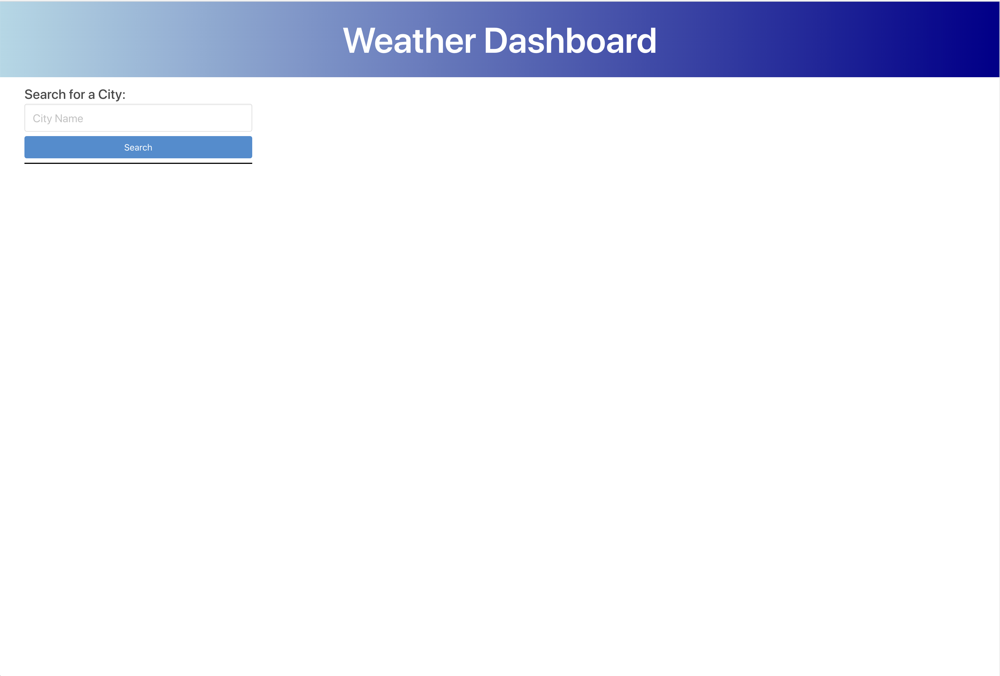
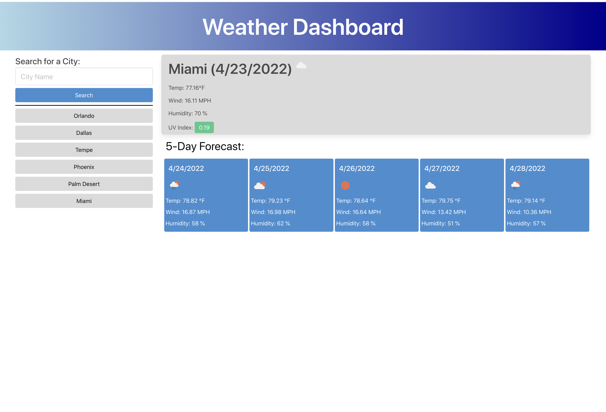

# Weather Dashboard

## Description

This project uses HTML, CSS and JavaScript to create a weather "dashboard" page.

## Installation

There is no installation needed, I have the page hosted here at Github. [https://cliff-rosenberg.github.io/06-Weather_Dashboard/](https://cliff-rosenberg.github.io/06-Weather_Dashboard/)

## Usage

Opening up the URL for the hosted page will bring up the Weather Dashboard. Enter a valid city name in the "search" field will bring up the current weather for that city as well as a five day forcast. The city name will be saved in a column on the left under the search bar for future reference if that current weather and forcast is desired again. The UV index is colored to reflect low, medium, or high levels.

<h2><u>Screenshots:</u></h2>

## Credits

Two APIs were used in this project:

[geocode.city](https://geocode.city/about.html) - Converts a city name to geocode coordinates

[openweathermap.org](https://openweathermap.org/api/one-call-api) - OpenWeather "One Call API 1.0" for current weather and weekly forecast

The page styling is controlled by the [Bulma](https://bulma.io/) CSS framework

## License

MIT License

Copyright (c) 2022 Cliff Rosenberg

Permission is hereby granted, free of charge, to any person obtaining a copy
of this software and associated documentation files (the "Software"), to deal
in the Software without restriction, including without limitation the rights
to use, copy, modify, merge, publish, distribute, sublicense, and/or sell
copies of the Software, and to permit persons to whom the Software is
furnished to do so, subject to the following conditions:

The above copyright notice and this permission notice shall be included in all
copies or substantial portions of the Software.

THE SOFTWARE IS PROVIDED "AS IS", WITHOUT WARRANTY OF ANY KIND, EXPRESS OR
IMPLIED, INCLUDING BUT NOT LIMITED TO THE WARRANTIES OF MERCHANTABILITY,
FITNESS FOR A PARTICULAR PURPOSE AND NONINFRINGEMENT. IN NO EVENT SHALL THE
AUTHORS OR COPYRIGHT HOLDERS BE LIABLE FOR ANY CLAIM, DAMAGES OR OTHER
LIABILITY, WHETHER IN AN ACTION OF CONTRACT, TORT OR OTHERWISE, ARISING FROM,
OUT OF OR IN CONNECTION WITH THE SOFTWARE OR THE USE OR OTHER DEALINGS IN THE
SOFTWARE.
